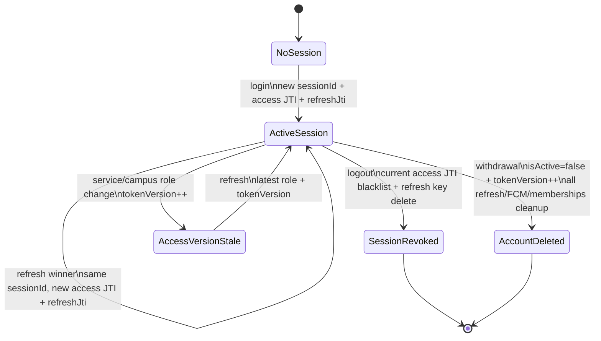

# Issue #158 JWT와 세션 수명주기 감사

## 1. 감사 기준선

- 감사 일자: 2026-07-12
- 기준 커밋: `634d19c7fea6753a37d64490b4dc97efe867eb43` (`origin/develop`)
- 작업 브랜치: `audit/158-jwt-session-lifecycle`
- 범위: JWT 서명/claim/만료, Redis access blacklist와 refresh allowlist/rotation,
  `tokenVersion`, logout/회원탈퇴/role 변경/FCM 수명주기, 401/403, 로그·오류·REST Docs 노출
- 제외: production/test/config/DB/Flyway/운영 인프라 변경, 운영 서버 스캔, credential 검증,
  부하 테스트, Docker QA
- 비밀정보 처리: secret/token/개인정보 값은 읽거나 기록하지 않고 선언 방식, 경로, 패턴 존재 여부만 확인

감사 기준은 GitHub Issue #158, `AGENTS.md`, `docs/codex/FAITHLOG_CODEX_HOOK.md`,
`docs/decision-log.md`, `docs/backend-implementation-policy.md`, #157 보안 감사 산출물,
OWASP ASVS 5.0.0과 OWASP API Security Top 10 2023이다.

## 2. 감사 인벤토리

### 2.1 파일

| 범주 | 파일 수 | 주요 대상 |
| --- | ---: | --- |
| JWT/Spring Security/Redis 인증 adapter | 11 | `SecurityConfig`, `JwtAuthenticationFilter`, `JwtProvider`, 인증 entry point/principal/checker, access blacklist와 refresh allowlist adapter |
| Auth/User 수명주기 | 18 | Auth/User Controller와 request DTO, login/refresh/logout/withdrawal service/support/port, `User`, `UserRepository` |
| service/campus role 무효화 | 2 | `AdminUserManagementService`, `CampusMemberManagementService` |
| FCM ownership와 cleanup | 5 | `FcmTokenController`, request, `FcmTokenCommandService`, Entity, Repository |
| 공통 오류 | 2 | `GlobalExceptionHandler`, `ErrorCode` |
| 설정과 schema | 9 | application profile 6개, Flyway V1/V5/V6 |
| production/config/schema 합계 | **47** | 위 범주 합계 |
| focused test | **8** | refresh/logout/withdrawal/role/FCM/Auth/REST Docs |

선행 문서는 Issue #158과 #157의 threat model, authorization matrix, audit findings를 포함해
7개 저장소 규칙·정책·감사 문서를 대조했다.

### 2.2 API

감사한 HTTP API는 10개다.

1. `POST /api/v1/auth/signup`
2. `POST /api/v1/auth/login`
3. `POST /api/v1/auth/refresh`
4. `POST /api/v1/auth/logout`
5. `GET /api/v1/users/me`
6. `DELETE /api/v1/users/me`
7. `PATCH /api/v1/admin/users/{userId}/role`
8. `PATCH /api/v1/admin/campuses/{campusId}/members/{campusMemberId}/campus-role`
9. `POST /api/v1/users/me/fcm-tokens`
10. `DELETE /api/v1/users/me/fcm-tokens/{tokenId}`

### 2.3 Redis key와 흐름

| key | value | 생성/조회/삭제 | TTL |
| --- | --- | --- | --- |
| `auth:refresh:{userId}:{sessionId}` | 현재 `refreshJti` | login 저장, refresh 비교·교체, logout 현재 session 삭제, 탈퇴 user 전체 삭제 | 발급 refresh token 만료까지, 기본 14일 |
| `auth:access:blacklist:{jti}` | 고정 revoked marker | 인증 필터 조회, logout/탈퇴 저장 | access token 남은 수명 + 60초 |

원본 access/refresh token은 Redis에 저장하지 않는다. 감사한 Redis 인증 흐름은 login 저장,
refresh 비교·교체, filter blacklist 조회, logout 현재 session 폐기, 회원탈퇴 전체 session 폐기의
5개다.

## 3. JWT 발급과 검증

| 항목 | 확인 결과 | 증거 |
| --- | --- | --- |
| 서명 | JJWT 0.12.6, preconfigured `SecretKey`로 signed claims 검증 | `JwtProvider.java:47,83-94,99-109,112-123` |
| algorithm | 32-byte HMAC key에서 발급은 HS256으로 고정되고 `alg=none`, RSA/EC key confusion, HS384/512 약한 key는 parser/key validation에서 거절 | `JwtProvider.java:47,93,108,113-117`, JJWT 0.12.6 |
| key 입력 | prod는 기본값 없는 `JWT_SECRET` 선언, 하지만 blank/최소 entropy/startup validation은 없음 | `application.yml:38`, `application-prod.example.yml:32`, `JwtProvider.java:47,125-130` |
| access type | `tokenType=ACCESS`, `jti`, `userId`, `role`, `sessionId`, `tokenVersion`, `iat`, `exp` | `JwtProvider.java:81-94` |
| refresh type | `tokenType=REFRESH`, `jti=refreshJti`, `userId`, `sessionId`, `refreshJti`, `iat`, `exp` | `JwtProvider.java:97-109` |
| type 분리 | access/refresh parser가 예상 `tokenType`을 비교하고 다르면 거절 | `JwtProvider.java:73-79,112-122` |
| 만료 | JJWT parser가 `exp`를 검증, 기본 access 1,800초/refresh 1,209,600초 | `JwtProvider.java:92,107,112-117`, `application.yml:39-40` |
| issuer/audience | 발급도 검증도 하지 않음 | `JwtProvider.java:81-123` |

issuer/audience 부재는 현재 단일 issuer·단일 resource server와 환경별 key 분리를 전제로 하면
즉시 악용 경로가 확인되지 않는다. 다만 ASVS 5.0.0 `v5.0.0-9.2.3`은 service audience 검증을
L2 요구사항으로 둔다. 다른 환경/서비스가 같은 key를 쓰는지는 저장소 밖 운영 확인 항목이다.

## 4. 인증 필터 재검증

`JwtAuthenticationFilter`는 Bearer access token을 다음 순서로 검사한다.

1. signature/expiration/`tokenType=ACCESS`를 파싱한다.
2. `jti`가 있고 `auth:access:blacklist:{jti}`에 없음을 확인한다.
3. `userId`, `role`, `sessionId`, `tokenVersion` claim 존재를 확인한다.
4. DB에서 user를 다시 읽어 `isActive=true`와 현재 `tokenVersion` 일치를 확인한다.
5. 검증된 JWT role claim으로 `ROLE_{role}` authority와 `AuthenticatedUser`를 만든다.

role claim 자체를 DB role과 직접 비교하지는 않지만 service/campus role 변경이 같은 DB
transaction 안에서 `tokenVersion`을 증가시키므로 기존 role claim은 다음 요청부터 거절된다.
예외가 발생하면 SecurityContext를 비우고 인증을 만들지 않는다.

## 5. token/session 상태 전이

| 전이 | access token | refresh/session | FCM/membership | 판정 |
| --- | --- | --- | --- | --- |
| login | 새 JTI, 30분 | 새 `sessionId`/`refreshJti`, 14일 allowlist | 변경 없음 | 확인 |
| refresh | 같은 `sessionId`, 새 access JTI | 새 refresh JTI로 교체 | 변경 없음 | 순차 회전 확인, 동시 회전 finding F-158-01 |
| old refresh 재사용 | access 미발급 | mismatch session key 삭제 | 변경 없음 | 현재 session fail-closed, 순차 테스트 확인 |
| logout | 요청에 사용한 access JTI만 blacklist | principal의 현재 session key 삭제 | 선택 `clientInstanceId`/FCM token을 user 범위로 삭제 | 승인된 현재 access/current refresh session 정책 |
| service role 변경 | 기존 access는 DB version mismatch로 401 | refresh session 유지 | 변경 없음 | refresh 시 최신 role/version 발급 |
| campus role 변경 | 기존 access는 DB version mismatch로 401 | refresh session 유지 | 변경 없음 | refresh 시 최신 version 발급 |
| 회원탈퇴 | 현재 JTI blacklist + active=false/version 증가로 모든 access 거절 | user의 refresh key 전체 삭제 | 모든 active FCM·campus membership 비활성화 | F-157-01의 마지막 ADMIN 공백은 중복하지 않음 |

## 6. API별 401/403와 invalidation 행렬

| API | 인증 실패 | 권한/요청 실패 | session/token 변화 |
| --- | --- | --- | --- |
| signup | 해당 없음 | 중복 email 400 | 없음 |
| login | credential/inactive user 401 | 해당 없음 | 새 session과 refresh allowlist 생성 |
| refresh | signature/type/exp/claim/allowlist/active user 실패 401 | 해당 없음 | 성공 시 같은 session의 refresh 회전, 실패 reuse는 session 삭제 |
| logout | access 없음·잘못됨·blacklist/version mismatch 401 | 별도 403 없음 | 현재 access JTI와 refresh session 폐기, 선택 기기 FCM cleanup |
| users/me GET | access 검증 실패 401 | 별도 403 없음 | 없음 |
| users/me DELETE | access 검증 실패 401 | password/문구 400, 이미 삭제 409 | 모든 access/refresh/FCM/membership 폐기 |
| service role PATCH | requester 인증 실패 401 | non-ADMIN 403, 마지막 ADMIN 강등 409 | target `tokenVersion` 증가 |
| campus role PATCH | requester 인증 실패 401 | campus role/계층 실패 403 | target `tokenVersion` 증가 |
| FCM POST | 인증/active user 실패 401 | DTO 실패 400 | 같은 client/같은 token active ownership을 현재 user로 정리 |
| FCM DELETE | 인증 실패 401 | 다른 user token ID는 owner-scoped 404 | 해당 user의 token row 비활성화 |

## 7. Redis 장애 동작

| 흐름 | 장애 시 관찰된 동작 | 판정 |
| --- | --- | --- |
| access 인증 blacklist 조회 | Redis 예외가 filter의 RuntimeException 경로로 들어가 인증 principal을 만들지 않음 | fail-closed, 결과 401 |
| refresh allowlist 조회/교체 | Redis 예외 뒤 token response를 반환하지 않음 | fail-closed, 공통 매핑이 없으면 5xx 가능 |
| logout blacklist/delete | Redis 예외 뒤 logout 성공 응답을 반환하지 않음 | fail-closed, 부분 외부 side effect 가능 |
| 회원탈퇴 전체 session 삭제/blacklist | Redis 예외 시 DB transaction은 rollback되지만 선행 Redis 작업은 DB rollback 대상이 아님 | fail-closed, 원자성은 DB/Redis cross-resource 한계 |

Redis 장애에서 인증을 허용하는 fail-open 경로는 확인하지 못했다. 실제 Upstash timeout,
eviction, retry, alert와 Cloud Run 오류 응답은 저장소 밖 운영 확인이 필요하다.

## 8. FCM 수명주기

- `POST /users/me/fcm-tokens`는 principal user를 사용한다.
- 같은 active `userId + clientInstanceId`의 다른 token과 같은 active token의 이전 owner를 먼저
  비활성화하고 flush한 뒤 현재 ownership을 upsert한다.
- Flyway V5는 active token과 active `userId + clientInstanceId`를 partial unique index로 보장한다.
- logout은 body의 token 또는 `clientInstanceId`가 있을 때만 현재 user 범위의 matching active row를
  삭제하며, 둘 다 없으면 인증 token logout은 그대로 성공한다.
- 회원탈퇴는 해당 user의 모든 active FCM token을 비활성화한다.
- 발송 조회는 active이면서 `lastSeenAt`과 `lastRefreshedAt`이 모두 90일 이내인 token만 반환한다.

같은 token의 ownership 이전은 공유/재설치 기기에서 이전 사용자 알림 누출을 막기 위한 승인 정책이다.

## 9. token/credential 노출 검사

- production source의 logger 호출에서 Authorization, access/refresh token, password, FCM token을
  기록하는 경로를 찾지 못했다.
- 인증 오류는 `AUTH_UNAUTHORIZED` 고정 응답이며 token/parser 예외 내용을 echo하지 않는다.
- secret prefix 검색은 값이 출력되지 않는 `rg -l` 방식으로 수행했고 현재 production 후보 파일은 0개였다.
- Auth REST Docs 테스트는 request/response를 마스킹하지 않아 실행 시 생성된 97개 snippet 중
  38개 파일에서 password/token 관련 필드 패턴이 확인됐다. 모두 test profile의 dummy credential과
  test JWT이며 `build/` 아래 ignored/untracked 산출물이라 production credential 노출 finding은 아니다.
  향후 실제 fixture 사용 방지를 위해 REST Docs header/field masking은 hardening 후보로 남긴다.

## 10. OWASP 대조

| 기준 | 대조 결과 |
| --- | --- |
| OWASP API2:2023 Broken Authentication | signature/type/expiration/version/rotation을 확인했고 refresh 동시 replay는 F-158-01 |
| ASVS `v5.0.0-7.2.1` | backend filter/service에서 session token 검증 |
| ASVS `v5.0.0-7.2.4` | 인증/재인증 시 새 token과 이전 token 종료 요구; refresh 동시성 대조 |
| ASVS `v5.0.0-7.4.1` | logout/expiration 후 session 재사용 금지; 현재 access-only logout 정책은 PM 재확인 항목 |
| ASVS `v5.0.0-7.4.2` | 계정 비활성화/삭제 시 모든 session 종료 확인 |
| ASVS `v5.0.0-9.1.1` | self-contained token MAC 검증 확인 |
| ASVS `v5.0.0-9.1.2` | 실질 사용 가능 algorithm은 HS256이지만 parser registry 명시 allowlist는 없음 |
| ASVS `v5.0.0-9.2.1/2` | exp와 access/refresh 목적 type 검증 확인 |
| ASVS `v5.0.0-9.2.3` | audience claim/검증 부재, L2 compliance/운영 확인 항목 |
| ASVS `v5.0.0-10.4.5` | OAuth authorization server 요구사항을 control intent로 준용: refresh 사용 후 즉시 폐기와 replay 대응 |

공식 참조:

- <https://github.com/OWASP/ASVS/tree/v5.0.0/5.0>
- <https://owasp.org/API-Security/editions/2023/en/0xa2-broken-authentication/>

상세 finding, false positive, 의도된 정책, 운영 미확인 항목은
`docs/security/158-audit-findings.md`에 기록한다.
